# System Architecture

## Overview

ml-leakage-guard is a **28-step fail-closed gate pipeline** for producing
publication-grade medical binary classification evidence. Every gate is an
independent CLI script that reads JSON/CSV inputs, performs a specific
validation, and writes a machine-readable JSON report with `status: pass` or
`status: fail`. If any gate fails, the entire publication claim is blocked.

The pipeline is deterministic: same inputs always produce the same verdict.

---

## Pipeline Execution Order (Mermaid)

```mermaid
flowchart TD
    subgraph "Phase 1 — Contract & Fingerprint"
        G01[1. request_contract_gate]
        G02[2. manifest_lock]
        G03[3. execution_attestation_gate]
    end

    subgraph "Phase 2 — Data Integrity"
        G04[4. leakage_gate]
        G05[5. split_protocol_gate]
        G06[6. covariate_shift_gate]
    end

    subgraph "Phase 3 — Reporting & Provenance"
        G07[7. reporting_bias_gate]
        G08[8. definition_variable_guard]
        G09[9. feature_lineage_gate]
    end

    subgraph "Phase 4 — Policy Compliance"
        G10[10. imbalance_policy_gate]
        G11[11. missingness_policy_gate]
        G12[12. tuning_leakage_gate]
    end

    subgraph "Phase 5 — Model Audit"
        G13[13. model_selection_audit_gate]
        G14[14. feature_engineering_audit_gate]
        G15[15. clinical_metrics_gate]
        G16[16. prediction_replay_gate]
    end

    subgraph "Phase 6 — Generalization & Robustness"
        G17[17. distribution_generalization_gate]
        G18[18. generalization_gap_gate]
        G19[19. robustness_gate]
        G20[20. seed_stability_gate]
        G21[21. external_validation_gate]
    end

    subgraph "Phase 7 — Statistical Rigor"
        G22[22. calibration_dca_gate]
        G23[23. ci_matrix_gate]
        G24[24. metric_consistency_gate]
        G25[25. evaluation_quality_gate]
        G26[26. permutation_significance_gate]
    end

    subgraph "Phase 8 — Aggregation"
        G27[27. publication_gate]
        G28[28. self_critique_gate]
    end

    G01 --> G02 --> G03
    G03 --> G04 --> G05 --> G06
    G06 --> G07 --> G08 --> G09
    G09 --> G10 --> G11 --> G12
    G12 --> G13 --> G14 --> G15 --> G16
    G16 --> G17 --> G18 --> G19 --> G20 --> G21
    G21 --> G22 --> G23 --> G24 --> G25 --> G26
    G26 --> G27 --> G28

    G28 -->|all pass| PASS[✅ Publication-Grade Claim]
    G28 -->|any fail| FAIL[❌ Claim Blocked]
```



---

## Gate Reference Table

| # | Script | Purpose | Output Report |
|---|--------|---------|---------------|
| 1 | `request_contract_gate.py` | Validate request schema, paths, and publication-policy anti-downgrade | `request_contract_report.json` |
| 2 | `manifest_lock.py` | Lock data/config/evaluation/gate-script fingerprints; optional baseline comparison | `manifest.json` |
| 3 | `execution_attestation_gate.py` | Verify signed run-attestation, artifact hashes, key validity, timestamp, witness quorum | `execution_attestation_report.json` |
| 4 | `leakage_gate.py` | Check split contamination, patient ID overlap, temporal boundary violations | `leakage_report.json` |
| 5 | `split_protocol_gate.py` | Enforce split protocol consistency, temporal/group safeguards | `split_protocol_report.json` |
| 6 | `covariate_shift_gate.py` | Detect train-vs-holdout covariate shift and split separability risk | `covariate_shift_report.json` |
| 7 | `reporting_bias_gate.py` | TRIPOD+AI / PROBAST+AI / STARD-AI checklist hard gate | `reporting_bias_report.json` |
| 8 | `definition_variable_guard.py` | Block disease-definition variable leakage | `definition_guard_report.json` |
| 9 | `feature_lineage_gate.py` | Block lineage-derived feature leakage | `lineage_report.json` |
| 10 | `imbalance_policy_gate.py` | Validate class-imbalance strategy and train-only resampling policy | `imbalance_policy_report.json` |
| 11 | `missingness_policy_gate.py` | Validate missing-data strategy, MICE scale guard, imputer isolation | `missingness_policy_report.json` |
| 12 | `tuning_leakage_gate.py` | Validate hyperparameter tuning and test-isolation protocol | `tuning_leakage_report.json` |
| 13 | `model_selection_audit_gate.py` | Audit candidate pool, one-SE replay, test-isolated model selection | `model_selection_audit_report.json` |
| 14 | `feature_engineering_audit_gate.py` | Audit feature-group provenance, train-only scope, stability evidence | `feature_engineering_audit_report.json` |
| 15 | `clinical_metrics_gate.py` | Validate clinical metric completeness and confusion-matrix consistency | `clinical_metrics_report.json` |
| 16 | `prediction_replay_gate.py` | Replay predictions from trace to verify metric reproducibility | `prediction_replay_report.json` |
| 17 | `distribution_generalization_gate.py` | Assess train-vs-holdout distribution shift and transport readiness | `distribution_generalization_report.json` |
| 18 | `generalization_gap_gate.py` | Fail-closed overfitting gap checks across train/valid/test | `generalization_gap_report.json` |
| 19 | `robustness_gate.py` | Subgroup robustness analysis | `robustness_gate_report.json` |
| 20 | `seed_stability_gate.py` | Multi-seed stability analysis | `seed_stability_report.json` |
| 21 | `external_validation_gate.py` | External cohort (cross-period, cross-institution) metric validation | `external_validation_gate_report.json` |
| 22 | `calibration_dca_gate.py` | Probability calibration and decision curve analysis | `calibration_dca_report.json` |
| 23 | `ci_matrix_gate.py` | Bootstrap CI matrix for primary metric across all splits and cohorts | `ci_matrix_gate_report.json` |
| 24 | `metric_consistency_gate.py` | Extract and validate metric from evaluation report | `metric_consistency_report.json` |
| 25 | `evaluation_quality_gate.py` | Enforce primary-metric CI quality and baseline improvement | `evaluation_quality_report.json` |
| 26 | `permutation_significance_gate.py` | Permutation-based falsification significance test | `permutation_report.json` |
| 27 | `publication_gate.py` | Aggregate all gate results into final publication verdict | `publication_gate_report.json` |
| 28 | `self_critique_gate.py` | Quality scoring and reviewer-grade self-critique | `self_critique_report.json` |

All reports are written to the `evidence/` directory. A final
`strict_pipeline_report.json` is emitted by the orchestrator after all gates.

---

## Data Flow

```
┌─────────────────────────────────────────────────────────┐
│                    Input Artifacts                       │
├─────────────────────────────────────────────────────────┤
│  configs/request.json          (structured request)     │
│  configs/split_protocol.json   (split safety contract)  │
│  configs/feature_lineage.json  (feature provenance)     │
│  configs/feature_group_spec.json                        │
│  configs/imbalance_policy.json                          │
│  configs/missingness_policy.json                        │
│  configs/tuning_protocol.json                           │
│  configs/performance_policy.json                        │
│  configs/reporting_bias_checklist.json                  │
│  configs/execution_attestation.json                     │
│  data/train.csv, valid.csv, test.csv                    │
│  data/external_*.csv (optional)                         │
└──────────────────┬──────────────────────────────────────┘
                   │
                   ▼
┌─────────────────────────────────────────────────────────┐
│              Training & Evaluation                      │
│  scripts/train_select_evaluate.py                       │
│  Produces: model_selection_report.json                  │
│            evaluation_report.json                       │
│            prediction_trace.csv.gz                      │
│            feature_engineering_report.json               │
│            distribution_report.json                     │
│            ci_matrix_report.json                        │
│            external_validation_report.json              │
│            robustness_report.json                       │
│            seed_sensitivity_report.json                 │
│            model.joblib                                 │
│            permutation_null_pr_auc.txt                  │
└──────────────────┬──────────────────────────────────────┘
                   │
                   ▼
┌─────────────────────────────────────────────────────────┐
│          28-Gate Strict Pipeline                        │
│  scripts/run_strict_pipeline.py                         │
│  Orchestrates gates 1–28 in sequence                    │
│  Writes: evidence/*_report.json (28 reports)            │
│          evidence/strict_pipeline_report.json           │
│          evidence/publication_gate_report.json           │
└──────────────────┬──────────────────────────────────────┘
                   │
                   ▼
┌─────────────────────────────────────────────────────────┐
│               Final Outputs                             │
│  evidence/publication_gate_report.json → pass/fail      │
│  evidence/self_critique_report.json → quality score     │
│  evidence/user_summary.md → human-readable summary      │
└─────────────────────────────────────────────────────────┘
```

---

## Orchestration Layers

The pipeline can be invoked at multiple levels of abstraction:

| Layer | Entry Point | Description |
|-------|------------|-------------|
| **Gate scripts** | `scripts/<gate>.py` | Individual validation steps |
| **Strict pipeline** | `scripts/run_strict_pipeline.py` | Sequential 28-gate orchestrator |
| **Productized workflow** | `scripts/run_productized_workflow.py` | Doctor → Preflight → Pipeline → Summary |
| **Onboarding** | `scripts/mlgg_onboarding.py` | Guided 8-step novice flow |
| **Unified CLI** | `scripts/mlgg.py` | Single entry point for all commands |
| **Interactive wizard** | `scripts/mlgg_interactive.py` | Terminal UX with command preview and profiles |

---

## Pipeline Phases Explained

### Phase 1 — Contract & Fingerprint (Gates 1–3)
Validates the request schema, locks all data/config/code fingerprints into a
manifest for reproducibility, and verifies the signed execution attestation
(cryptographic proof of who ran what, when, with which artifacts).

### Phase 2 — Data Integrity (Gates 4–6)
Checks for patient-level split contamination, temporal boundary violations,
split protocol compliance, and train-vs-holdout covariate shift.

### Phase 3 — Reporting & Provenance (Gates 7–9)
Validates TRIPOD+AI/PROBAST+AI reporting checklist completion, blocks
disease-definition variables from being used as predictors, and audits
feature lineage for post-index or derivation-chain leakage.

### Phase 4 — Policy Compliance (Gates 10–12)
Enforces class-imbalance handling policy (train-only resampling),
missing-data/imputation strategy (with MICE scale guard), and
hyperparameter tuning isolation (no test data in search).

### Phase 5 — Model Audit (Gates 13–16)
Audits the candidate model pool and one-SE selection rule, feature
engineering provenance and stability, clinical metric completeness
(accuracy/precision/NPV/sensitivity/specificity/F1/F2/AUC), and replays
predictions from the trace file to verify metric reproducibility.

### Phase 6 — Generalization & Robustness (Gates 17–21)
Assesses distribution shift between splits, detects overfitting via
generalization gap analysis, validates subgroup robustness, checks
multi-seed stability, and evaluates performance on external cohorts
(cross-period and cross-institution).

### Phase 7 — Statistical Rigor (Gates 22–26)
Validates probability calibration and decision curves, computes bootstrap
CI matrices, checks metric consistency between reports, enforces CI quality
thresholds, and runs permutation-based falsification tests.

### Phase 8 — Aggregation (Gates 27–28)
Aggregates all 26 gate verdicts into a single publication gate decision,
then runs self-critique scoring to produce a reviewer-grade quality
assessment with recommendations.

---

## Key Design Principles

- **Fail-closed**: Any single gate failure blocks the publication claim.
  No manual override mechanism exists.
- **Deterministic**: Same inputs produce the same verdict. Exit codes are
  `0` (pass) or `2` (fail).
- **Machine-parseable**: All outputs are JSON with `status` field.
- **Composable**: Each gate is a standalone CLI script that can be run
  independently or orchestrated.
- **Medical non-negotiable**: Hard rules (never tune on test, never fit
  preprocessors on combined splits, never use target for imputation) are
  enforced structurally, not by convention.

---

## Directory Structure

```
ml-leakage-guard/
├── scripts/                    # All executable scripts
│   ├── mlgg.py                 # Unified CLI entry point
│   ├── mlgg_onboarding.py      # Guided onboarding flow
│   ├── mlgg_interactive.py     # Interactive terminal wizard
│   ├── run_strict_pipeline.py  # 28-gate orchestrator
│   ├── run_productized_workflow.py  # Full UX wrapper
│   ├── train_select_evaluate.py     # Training pipeline
│   ├── split_data.py           # Safe data splitting
│   ├── _gate_utils.py          # Shared gate utilities
│   ├── *_gate.py               # 26 individual gate scripts
│   ├── definition_variable_guard.py # Gate 8
│   └── manifest_lock.py        # Gate 2
├── configs/                    # Configuration files
│   ├── request.json            # Structured request
│   └── *.json                  # Policy/spec files
├── data/                       # Split CSV files
├── evidence/                   # Gate reports and artifacts
├── models/                     # Trained model artifacts
├── keys/                       # Attestation keypairs
├── references/                 # Documentation and templates
│   ├── *.example.json          # Configuration templates
│   ├── Beginner-Quickstart.md  # Novice tutorial
│   ├── Troubleshooting-Top20.md # Failure remediation
│   └── benchmark-registry.json # Frozen benchmark registry
├── experiments/                # Authority E2E experiments
├── .github/workflows/          # CI pipelines
├── SKILL.md                    # Workflow contract
└── README.md                   # User guide (EN + CN)
```
